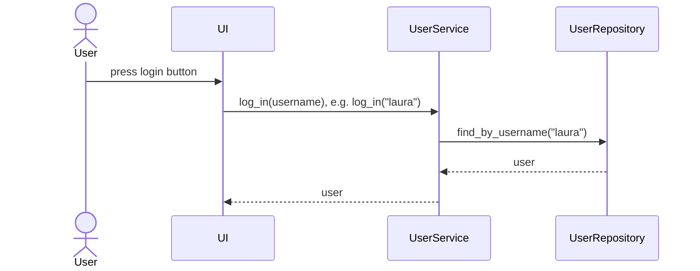

# Structure

This is the packaging diagram representing the structure of the program:

[diagram]

# User Interface
The user interface has 4 different views. They are:
* Login
* Create account
* Enter equation
* Found derivative
Every view is a separate class, the user can only see one view at a time. The user interface is largely kept separate from the application logic.

This is the sequence diagram describing how to create a user. If there is not already a user with the same username, it works as follows:

        
